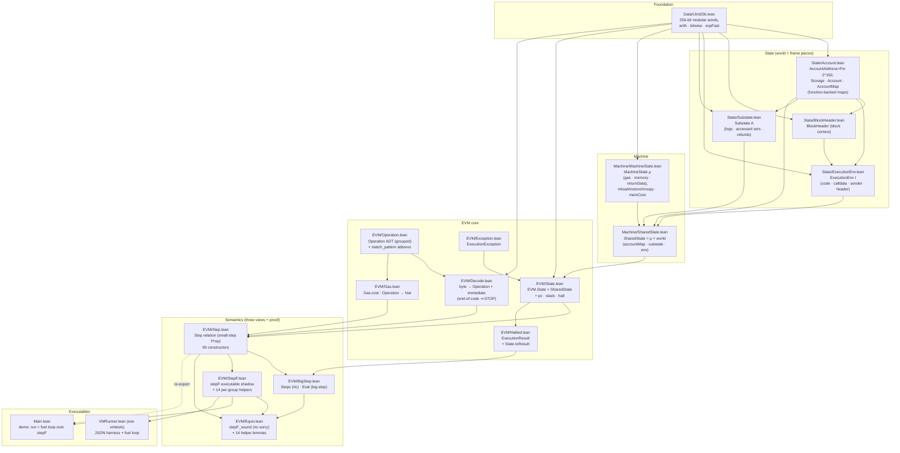
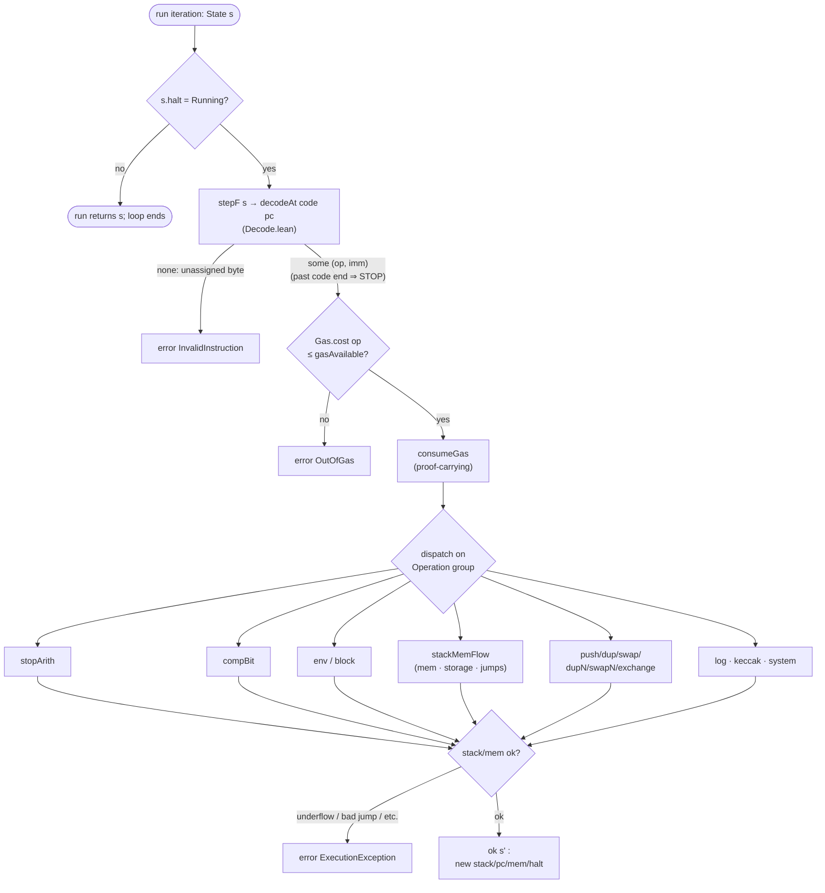
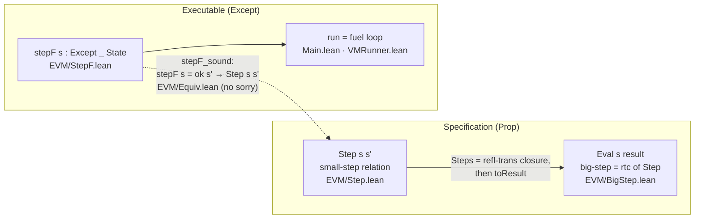

# Architecture

How the **EvmSemantics** codebase is organized and what happens where. For the
operational quick-reference (commands, conventions, opcode-change checklist) see
`AGENTS.md`; for the conformance harness see `VMTESTS.md`. This document explains
the *structure* — the layers, the data flow of an execution step, and the
three-views-plus-soundness design at the heart of the project.

## The big idea

The project defines EVM execution **three times** and proves the executable
definition agrees with the relational one:

- **`Step`** — a `Prop`-valued small-step relation (the *specification*, the
  source of truth).
- **`Eval`** — a big-step relation built as the reflexive-transitive closure of
  `Step`, projected to a flat result.
- **`stepF`** — an `Except`-valued *executable* function shadowing `Step`
  opcode-by-opcode (the thing the demo and the test harness actually run).

`EVM/Equiv.lean` closes `stepF_sound : stepF s = .ok s' → Step s s'` with no
`sorry`, so any *successful* `stepF` step is backed by a derivation in the
relational spec. This covers only the `.ok s'` path — `stepF`'s `.error`
(exception) results are **not** in general matched by a `Step` successor; the
memory-expansion `OutOfGas` case (`chargeMem` → `.error`, with no Step-side
memory-OOG rule) is a current example.

## Module layers

Modules form a clean dependency stack — foundation → state → machine → EVM core
→ semantics → executables. Everything is re-exported through the root
`EvmSemantics.lean`.

### What each module owns

**Foundation**
- **`Data/UInt256.lean`** — the 256-bit word `UInt256` (a wrapper over
  `Fin (2^256)`) with modular `add/sub/mul/div/mod/addMod/mulMod`, bitwise
  `land/lor/xor/lnot/shiftLeft/shiftRight`, and two exponentiations: `exp`
  (the clean `a^b % 2^256` *spec*, used by `Step`) and `expFast` (modular
  fast-exponentiation, used by `stepF`), with `expFast_eq_exp` proving them
  equal. There is **no separate `Stack` module** — the operand stack is just
  `List UInt256`.

**State (world + per-frame pieces)** — all maps are *functions*, not hash maps,
trading enumerability for clean algebraic reasoning (`Function.update`, `simp`):
- **`Account.lean`** — `AccountAddress = Fin (2^160)`, `Storage = UInt256 →
  UInt256`, the `Account` record, and `AccountMap = AccountAddress → Account`,
  each with `get`/`set` and `@[simp]` get-set lemmas.
- **`BlockHeader.lean`** — the block-context fields BLOCK opcodes read.
- **`ExecutionEnv.lean`** — the immutable per-frame environment `I` (code,
  calldata, sender/source/owner, value, gas price, header, depth,
  `permitStateMutation` for static-call detection).
- **`Substate.lean`** — the accrued substate `A`: `LogSeries`, accessed-account
  and accessed-storage-key sets (`AddressSet`/`StorageKeySet`, also functions to
  `Prop`), and refund counter.

**Machine**
- **`MachineState.lean`** — the machine state `μ`: `gasAvailable`, `memory`
  (a `ByteArray`), `activeWords`, `returnData`, `hReturn`. Owns memory access
  (`mload`/`mstore`/`mstore8`/`mcopy`, `readPadded` with zero-padding) and the
  Yellow-Paper quadratic memory-cost machinery (`memCost`,
  `memExpansionDelta`).
- **`SharedState.lean`** — bundles `MachineState` with the world (`accountMap`,
  `substate`, `executionEnv`) via `extends`.

**EVM core**
- **`Operation.lean`** — the `Operation` ADT, deliberately *grouped* into
  sub-inductives (`StopArithOps`, `CompareBitwiseOps`, `KeccakOps`, `EnvOps`,
  `BlockOps`, `StackMemFlowOps`, `SystemOps`) and structs (`PushOp`, `DupOp`,
  `SwapOp`, `DupNOp`, `SwapNOp`, `ExchangeOp`, `LogOp`). `@[match_pattern]`
  abbrevs (`STOP`, `ADD`, …) let the rest of the code name flat opcodes while
  the grouping lets `stepF`/`Step`/`Equiv` dispatch per-group. EIP-8024
  `DUPN`/`SWAPN`/`EXCHANGE` live here.
- **`Exception.lean`** — `ExecutionException` (stack underflow/overflow, OOG,
  invalid jump, static-mode violation, …).
- **`State.lean`** — `EVM.State` extends `SharedState` with `pc`, `stack :
  List UInt256`, `execLength`, and `halt : HaltKind` (`Running | Success |
  Returned | Reverted | Exception e`). Helpers: `replaceStackAndIncrPC`,
  `incrPC`, `haltWith`.
- **`Decode.lean`** — `opcodeOf : UInt8 → Option Operation` and `decodeAt :
  ByteArray → pc → Option (Operation × Option (UInt256 × Nat))` returning the
  operation plus any PUSH immediate (value + width). Reading past code end
  decodes as `STOP` (Yellow-Paper zero-padding).
- **`Gas.lean`** — `Gas.cost : Operation → Nat`, the real Yellow-Paper *base*
  fee for every opcode. Two kinds of dynamic cost are not yet modelled: (a)
  state-dependent opcodes (SSTORE/SLOAD, EIP-2929 cold/warm `BALANCE`/`EXT*`,
  and the out-of-scope CALL/CREATE/SELFDESTRUCT family) are stubbed at cost `1`
  with an explicit `TODO(dynamic)` comment; (b) per-word/byte/topic add-ons
  (EXP, the `*COPY` ops, LOG, KECCAK256) carry their correct static base only,
  with no `TODO(dynamic)` marker — so don't expect that marker to enumerate
  every non-comparable opcode (`VMRunner.gasComparableOpcode` is the actual
  gate). See `VMTESTS.md` for the breakdown.
- **`Halted.lean`** — `ExecutionResult` and `State.toResult`, projecting a
  halted `State` into the flat success/returned/reverted/exception sum.

**Semantics** — see the next two sections.

**Executables**
- **`Main.lean`** — `initState` + a `partial def run` fuel loop over `stepF`;
  the demo runs `PUSH1 5; PUSH1 3; ADD; STOP`.
- **`VMRunner.lean`** (exe `vmtests`) — the conformance harness; see below.

## Data flow of one execution step

`stepF` (and the relation `Step` it shadows) turn one running `State` into the
next; the surrounding `run` loop owns the halt guard, since `stepF` itself just
errors on an already-halted state. The flow of one `run` iteration:

The dispatch arms map one-to-one to the `stepF.*` helpers in `StepF.lean`
(`stopArith`, `compBit`, `keccak`, `env`, `block`, `stackMemFlow`, `push`,
`dup`, `swap`, `dupN`, `swapN`, `exchange`, `log`, `system`) — and one-to-one to
the soundness lemmas in `Equiv.lean`. The halting opcodes are ordinary `ok s'`
outcomes that set `s'.halt` (STOP ⇒ `Success` in `stopArith`; RETURN/REVERT ⇒
`Returned`/`Reverted` in `system`) — including the implicit STOP from running
off the end of the code. Neither `stepF` nor `Step` loops on its own; iteration
to a halt is the `run` fuel loop in each executable, which is also what skips
already-halted states — `stepF` called directly on a non-`Running` state just
returns `.error .InvalidInstruction`.

## The three views and the soundness bridge

- **`Step`** (`EVM/Step.lean`) — each success constructor names its premises
  explicitly. The typical shape is `h_op` (decoded operation), `h_running`,
  `h_gas` (`Gas.cost op ≤ s.gasAvailable`, a `Nat` `≤`), and an `h_stack` shape,
  but it varies: `Step.stop` carries no `h_gas`/`h_stack` (while
  `RETURN`/`REVERT` keep `h_gas`/`h_stack`/`h_mem`) and stackless reads omit
  `h_stack`. `consumeGas` takes the gas-sufficiency proof
  as an argument so the saturating subtraction is provably safe. `keccak256` is an `opaque` function here. Halted states have
  no successors (`Step.not_from_halted`).
- **`Eval`** (`EVM/BigStep.lean`) — `Steps` is the reflexive-transitive closure;
  `Eval s r` holds when `Steps` reaches a halted state whose `toResult` is `r`.
- **`stepF`** (`EVM/StepF.lean`) — the same opcode logic as a total `Except`
  function, factored into the per-group helpers. `popN`/`popN_correct` recover
  list witnesses (used by `log`); `chargeMem`/`chargeMem2` apply memory-expansion
  gas so a huge offset hits `OutOfGas` before any allocation.
- **`Equiv`** (`EVM/Equiv.lean`) — the bridge. 14 per-helper lemmas
  (`stopArith_sound`, …) each invert a helper's `match` and either apply the
  matching `Step` constructor or derive a contradiction from a `.ok` hypothesis
  on an `.error` path; the headline `stepF_sound` splits on
  halt/decode/gas/operation and dispatches to them. Also exports
  `Eval.halted_inv`.

## The conformance harness (`VMRunner.lean`)

The `vmtests` executable runs the legacy ethereum/tests **VMTests** corpus
against `stepF` via its `run` fuel loop (cap `2_000_000`):

1. **Parse** a test JSON → build the initial `State` (`buildStateWith` /
   `mkAccount`, hex helpers).
2. **Pre-scan the bytecode** (`scanCode` + `gasComparableOpcode` /
   `skipReasonOf`) to pick a gas mode and decide skips: *gas-checked* (run with
   the real `exec.gas` budget and compare the remaining `gas`) when every opcode
   has a faithful fixed cost; otherwise *gas-ignored* (inject `hugeGas = 2^63`,
   never compare gas). Unsupported opcodes (CALL/CREATE family, SELFDESTRUCT)
   and keccak-dependent tests are skipped here.
3. **Run** to a halt, then **compare** (`cmpAccounts`) storage, return-data,
   balance, and nonce against the expected post-state, producing an `Outcome`
   (`pass` / `fail` / `skip` / `incon` / `crash`).
4. **Aggregate** into a `Tally`. `runDir` fans the files out across in-process
   Lean `Task` workers (`IO.asTask`, `-j` / `VMTESTS_JOBS`, default 8) — there is
   **no subprocess isolation**, so a worker that throws is one `crash` but a hard
   panic aborts the whole run; `--file` mode runs a single test in its own
   process for manual isolation.

CI runs the full suite non-gating against `.github/vmtests-baseline.txt`. See
`VMTESTS.md` for results, gas-mode details, and the known evaluator gaps the
suite surfaces.
